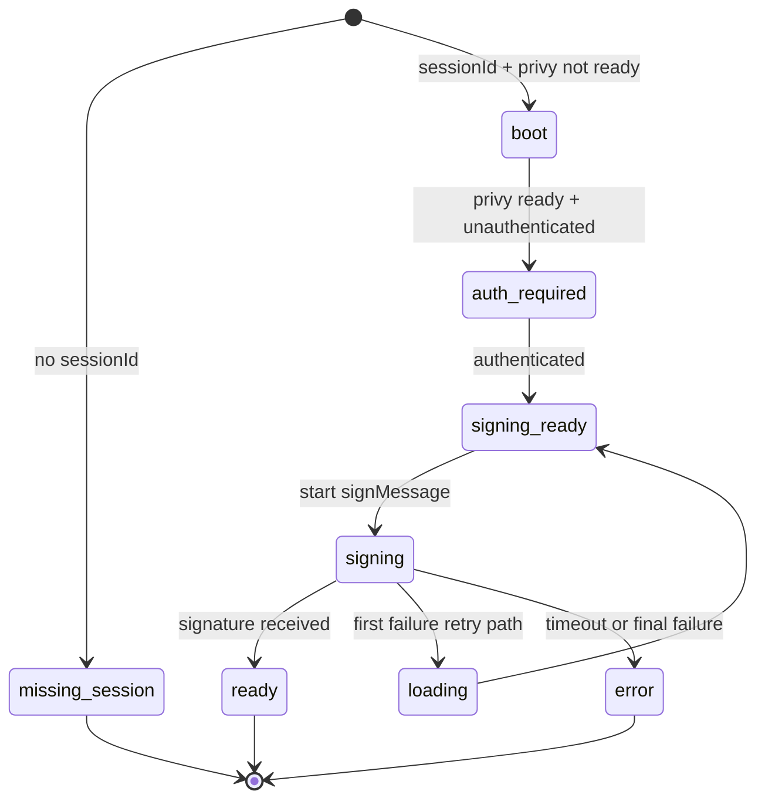

# Connect auth handoff: system guide

This is the canonical handoff reference for `connect` auth flow behavior.

Use this doc to onboard quickly, debug safely, and understand why specific trade-offs were made.

---

## TL;DR (quick scan)

- Canonical entry is now `/?sessionId=...` -> `/login?sessionId=...` (not `/connect`).
- Handoff context is versioned, TTL-bound, and resolved by precedence: `URL > cookie > storage`.
- `/login` owns post-auth destination via one resolver (`resolvePostAuthDestination()`).
- `/connect` signs the master key with explicit timeout/error handling (no infinite spinner).
- Cookie redacts `secret`; storage retains `secret` for OAuth return recovery.
- Debug/internal query params are filtered out of outbound integration URLs.

---

## Why this exists

This system was built to eliminate four recurring failure classes:

1. `Preparing...` hanging forever in connect signing paths.
2. Lost handoff context across full-page auth/OAuth redirects.
3. Wrong post-login destination despite a valid launch context.
4. Redirect logic drift across routes/hooks.

---

## Core contract

Primary module:

- `connect/src/app/_lib/handoff-contract.ts`

Primary context type:

- `ConnectHandoffContext`
  - `version`
  - `sessionId` (required)
  - `secret` (nullable)
  - `app`, `appId`, `appName` (integration metadata)
  - `returnTo` (validated internal path)
  - `createdAt` (TTL clock)

Hard invariants:

- `sessionId` missing => not a valid handoff context.
- `returnTo` must be internal path (`/...`, never protocol-relative).
- persisted payload must match current `version`.
- expired payload (`ttl > 10m`) is ignored.

---

## Architecture map

| Concern                                     | Owner                            |
| ------------------------------------------- | -------------------------------- |
| parse/validate/precedence/TTL               | `handoff-contract.ts`            |
| client-side resolution + clear escape hatch | `use-handoff-resolution.ts`      |
| root canonicalization                       | `app/page.tsx` + `middleware.ts` |
| login auth orchestration + destination      | `use-login-page.ts`              |
| connect signing orchestration               | `use-connect-page.ts`            |

---

## End-to-end flow (Mermaid)

```mermaid
flowchart TD
  A[External app opens /?sessionId=...] --> B{Root has valid handoff params?}
  B -- yes --> C[Canonicalize to /login?sessionId...]
  B -- no --> D[/login]

  C --> E[Login route resolves handoff context]
  E --> F{Authenticated?}
  F -- no --> G[Privy auth flow / OAuth]
  G --> H[Re-enter /login]
  H --> E
  F -- yes --> I[resolvePostAuthDestination]

  I --> J{Valid connect context?}
  J -- yes --> K[/connect?sessionId...]
  J -- no --> L[/admin fallback]

  K --> M[Connect route resolves handoff context]
  M --> N{Auth still valid?}
  N -- no --> C
  N -- yes --> O[Add signer if needed]
  O --> P[Sign master key with timeout]
  P --> Q{Success?}
  Q -- yes --> R[ready + deep link + clear handoff context]
  Q -- no --> S[error state + retry guidance]
```

---

## Connect signing state model (Mermaid)



Notes:

- Timeout is explicit (`15s`) in `use-connect-page.ts`.
- One retry is allowed for non-timeout signing failure.
- Timeout path does not start overlapping sign attempts.

---

## Resolution and persistence semantics

### Source precedence

Resolver order is strict:

1. URL query
2. Cookie (`vana_connect_handoff`)
3. Local storage (`vana_connect_session`)

First valid, non-expired candidate wins.

### Secret handling

- Cookie payload intentionally stores `secret: null` (redacted).
- Storage keeps full context, including `secret`, for OAuth return continuity.
- If URL/cookie candidate has `secret = null` and storage has same `sessionId`, resolver backfills `secret` from storage.

### Escape hatch

`handoff=clear` in query triggers:

- immediate `clearHandoffContext()`
- redirect to same path with handoff keys stripped (`sessionId`, `secret`, `app`, `appId`, `appName`, `returnTo`, `handoff`)

---

## Route responsibilities

### `/` (root)

- If valid handoff query: canonicalize to `/login?...`.
- Else: redirect to `/login`.

### `/login`

- Resolve handoff context from URL and persistence fallback (when expected).
- Persist handoff before auth redirects.
- On auth complete, destination is centralized (`resolvePostAuthDestination()`).
- If no valid context, fallback currently defaults to `/admin`.

### `/connect`

- Resolve handoff context with controlled persistence restore.
- If no session and unauthenticated: route to `/login`.
- If no session and authenticated: show deterministic no-session fallback UI (no loop).
- Persist context until terminal success/error branches.

### `/logout`

- Clears handoff context to prevent stale resume behavior.

---

## Trade-offs we made

### 1) Canonicalize root handoff to `/login` (not `/connect`)

Why:

- reduces `/ -> /connect -> /login` bounce chain
- makes auth gating explicit up front

Cost:

- initial URL no longer lands directly on connect UI

### 2) Keep `secret` in storage but redact cookie

Why:

- OAuth return resilience without leaking secret into cookie

Cost:

- `secret` still exists client-side in localStorage during active handoff window

### 3) Versioned persisted payloads only

Why:

- strict parser compatibility and less ambiguous migration behavior

Cost:

- older unversioned payloads are intentionally ignored

### 4) Minimal middleware

Why:

- middleware only normalizes URL entry; no auth/wallet logic server-side

Cost:

- most behavior remains client-runtime dependent (Privy/wallet timing)

### 5) One retry on sign failure

Why:

- wallet connector can come up late; single retry recovers common transient failures

Cost:

- still possible to fail under unstable wallet/browser conditions

---

## Caveats and gotchas

1. **Runtime wallet behavior is nondeterministic by nature**
   - signing success depends on provider readiness and browser session quality.

2. **Debug params are non-contract**
   - `authDebug`, `scenario`, etc. must never leak into canonical integration URLs.

3. **Fallback destination is intentional**
   - no-context login completion goes to `/admin` unless explicitly overridden.

4. **Next 16 warning still exists**
   - `middleware.ts` convention is deprecated in favor of `proxy` (follow-up item).

5. **Resolver flags can change behavior sharply**
   - `includeUrl/includeCookie/includeStorage` and `restoreFromPersistence` should be changed carefully.

---

## Failure signatures -> likely root cause

| Symptom                                          | Likely cause                                     |
| ------------------------------------------------ | ------------------------------------------------ |
| Lands on wrong post-auth page with valid handoff | resolver or returnTo policy regression           |
| Infinite `Preparing...`                          | connect phase transition/timeout path regression |
| Debug params in download URL                     | query whitelist regression                       |
| Login OAuth return loses context                 | persistence restore guard regression             |
| Stale session appears after logout               | clear handoff path regression                    |

---

## Verification playbook

Use `connect/docs/260223-connect-auth-handoff-post-fix-human-checklist.md` for manual smoke.

Highest-value checks:

1. Root canonicalization to `/login?...` with param whitelist.
2. Signed-out `/connect?...` redirects to `/login?...` in panelized UX.
3. Download link keeps only contract params.
4. Wallet timeout produces explicit error state.
5. Logout removes stale handoff restore.
6. Direct `/connect` and `/` without context behave deterministically.

---

## Implementation notes for future changes

When changing flow behavior:

1. Update contract first (`handoff-contract.ts`).
2. Keep redirect policy centralized (`resolvePostAuthDestination()`).
3. Keep middleware URL-only.
4. Add/adjust tests in:
   - `connect/src/app/_lib/handoff-contract.test.ts`
   - `connect/src/app/(public)/login/use-login-page.test.ts`
   - `connect/src/app/page.test.ts`
   - `connect/src/middleware.test.ts`
5. Re-run human checklist for runtime confidence.

---

## Open follow-ups

- Migrate Next middleware convention to proxy.
- Add one browser E2E for deep-link -> login -> connect resume.
- Re-evaluate whether `secret` should remain in local storage.
- Document OAuth callback marker contract as a formal spec section.

---

## Primary file index

- `connect/src/app/_lib/handoff-contract.ts`
- `connect/src/app/_lib/use-handoff-resolution.ts`
- `connect/src/app/(public)/login/use-login-page.ts`
- `connect/src/app/(handoff)/connect/use-connect-page.ts`
- `connect/src/app/page.tsx`
- `connect/src/middleware.ts`
